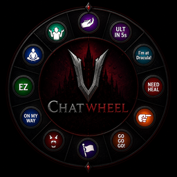

# ChatWheel for V Rising

ChatWheel is a server-side modification for V Rising that transforms the emote wheel into a fully functional communication wheel.

It supports chat commands and dynamic placeholders that provide precise information such as cooldowns, debuff timers, and player locations in real time. By reducing language barriers and improving clarity of communication, ChatWheel enables teams to coordinate more effectively and perform at a higher competitive level.

Feel free to contact me on Discord (nova_nova) if you have any questions or need assistance with the mod.

## Player Commands

- `.cw bind (scope) (message)`
  - will bind a message to the emote chosen after executing this command
  - scope can be `local` or `clan`
  - message supports commands and placeholders
  - Example: _.cw bind clan "[$location] 1"_
  - Example: _.cw bind local ".stash"_
  - Example: _.cw bind local ".pull rosepot 10"_

- `.cw unbind`
  - will unbind the message on the emote chosen after executing this command

- `.cw list`
  - will list all the bound messages

- `.cw enable`
  - will enable the ChatWheel for the player if it's disabled

- `.cw disable`
  - will disable the ChatWheel for the player to allow use of the original emotes without clearing or unbinding chatwheels

## Message Placeholders

- `$location`
  - Replaced by the player's current location derived from the chunk name. Admins are allowed to rename the chunk to whatever they wish to. Castle owner's name will be added if the player is inside a claimed territory.
  - Example: _.cw bind clan "im at $location"_
  - Example: _.cw bind clan "[$location] 1"_
- `$combatTimer`
  - Replaced by the player's PvP Combat debuff timer.
  - Example: _.cw bind clan "I need $combatTimer to drop combat and fully heal"_
  - Example: _.cw bind clan "$combatTimer fh"_
- `$baneTimer` and `$deathTimer`
  - Replaced by the player's Vampire's Bane debuff timer and expected death timer.
  - Example: _.cw bind clan "chill for $baneTimer or I'm dead for $deathTimer"_
- `$cdUlt`
  - Replaced by the player's cooldown for the ultimate.
  - Example: _.cw bind clan "ULT in $cdUlt"_

## Admin Commands

- `.cw rc (name)`
  - Renames the current chunk you are in.
  - Example: _.cw rc "Admin Hangout Spot"_

[V Rising Modding Discord](https://vrisingmods.com/discord) | [V Rising Modding Wiki](https://wiki.vrisingmods.com)

## Installation

1. Install BepInEx, which is required for modding VRising. Follow the instructions provided at [BepInEx Installation Guide](https://wiki.vrisingmods.com/user/bepinex_install.html) to set it up correctly in your VRising game directory.
   - **Note:** Until BepInEx is updated for 1.1, please do not use the thunderstore version. Get the correct testing version https://wiki.vrisingmods.com/user/game_update.html.

2. Download the ChatWheel mod along with its dependency (VCF). Ensure you select the correct versions that are compatible with your game.
   - **Note:** Again, until dependencies are updated for 1.1, please do not use the thunderstore version. Get the correct testing version https://wiki.vrisingmods.com/user/game_update.html.

3. After downloading, locate the .dll files for ChatWheel and its dependency. Move or copy these .dll files into the `BepInEx\Plugins` directory within your VRising installation folder.
   - **Single Player Note:**
     - If you are playing in single player mode, you will need to install [ServerLaunchFix](https://thunderstore.io/c/v-rising/p/Mythic/ServerLaunchFix/). This is a server-side mod that is essential for making the commands work properly on the client side. Make sure to download and place it in the same `BepInEx\Plugins` directory.

4. Launch the Game: Start VRising. If everything has been set up correctly, ChatWheel should now be active in the game. Test by typing `.cw list`.

## Credits

- [Odjit](https://github.com/Odjit) for KindredCommands. This mod was originally built upon it!

## License

This project is licensed under the AGPL-3.0 license.
